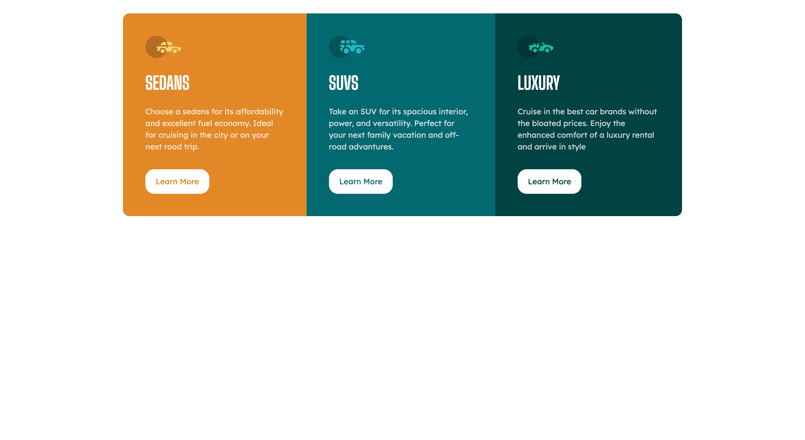
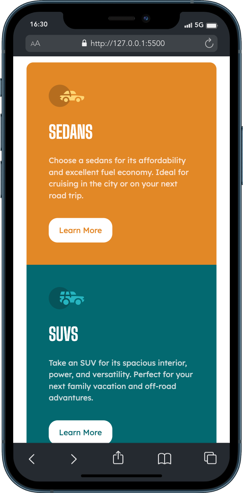

# Frontend Mentor - 3-column preview card component solution

This is a solution to the [3-column preview card component challenge on Frontend Mentor](https://www.frontendmentor.io/challenges/3column-preview-card-component-pH92eAR2-). Frontend Mentor challenges help you improve your coding skills by building realistic projects. 

## Table of contents

- [Overview](#overview)
  - [The challenge](#the-challenge)
  - [Screenshot](#screenshot)
  - [Links](#links)
- [My process](#my-process)
  - [Built with](#built-with)
  - [What I learned](#what-i-learned)

**Note: Delete this note and update the table of contents based on what sections you keep.**

## Overview

### The challenge

Users should be able to:

- View the optimal layout depending on their device's screen size
- See hover states for interactive elements

### Screenshot

Desktop Preview


Mobile Preview


### Links

- Solution URL: [Add solution URL here](https://your-solution-url.com)
- Live Site URL: [Add live site URL here](https://your-live-site-url.com)

## My process

### Built with

- Mobile-first workflow
- Pure HTML & CSS

**Note: These are just examples. Delete this note and replace the list above with your own choices**

### What I learned

From this challenge, I really learn a lot. i learn how to use Transition, ::After & ::Before Pseudo CSS class

I want to mention pseudo-class ::Before, it was a little bit challenging for me to understand how this Pseudo class worked. With a lot of googling, finally i did it lol. 

I use this pseudo-class to reach my goals, when the user is hovering over the card I want to show the image but the image has the filter property greyscale(100%). without ::Before, if I implement this filter, the filter will apply to all the elements inside the tag.

Yeah, this kind of goal easily can be reached by editing the image manually. But, the goal that i want make me learn new things

```html
<div class="bgContainer">
  <div class="bgSedan">
    <div class="container sedan">
         
          <h1>Sedans</h1>
          <p>
            Choose a sedans for its affordability and excellent fuel economy. Ideal for cruising in the city or on your next road trip.
          </p>
          <button class="btn btnSedan" type="submit">Learn More</button>
      </div>
   </div>
  </div>
```
```css
.bgContainer {
        position: relative;
    }

  .bgContainer .bgSedan::before {
      content: "";
        position: absolute;
        top: 0;
        width: 100%;
        height: 100%;
        background-image: url("/images/sedanImage.jpg");
        border-radius: 12px 0 0 12px;
        background-size: cover;
        background-repeat: no-repeat;
        filter: grayscale(100%);
    }
```
